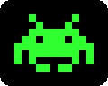
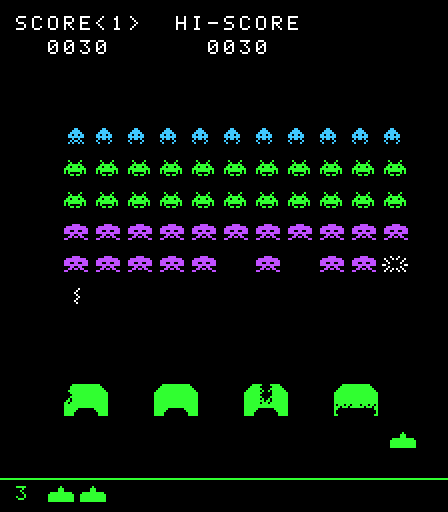

# insert-coin

<p align="center">
  <a href="https://darkhelmet67.github.io/insert-coin/space-invaders/"></a>
</p>

<p align="center">
  <a href="https://github.com/DarkHelmet67/insert-coin/actions/workflows/deploy.yml"></a>
  <a href="LICENSE"></a>
  <br>
  
  
  
  
  
  
  
  
  
</p>

Giochi arcade coin-op degli anni '80 ricostruiti da zero in **TypeScript** su **HTML5 Canvas**, con l'aiuto di Claude (AI) come compagno di sviluppo.

Il progetto ha due obiettivi:

1. **Giocare**: ogni gioco è una pagina web autonoma (un HTML, un CSS, un modulo JavaScript ES moderno).
2. **Imparare**: ogni passo è documentato con guide passo-passo, dalla creazione del monorepo alla collisione pixel-perfect, insieme a un diario di come è stata usata l'AI.

## Giochi

**▶ [Gioca online](https://darkhelmet67.github.io/insert-coin/)**: i giochi sono pubblicati su GitHub Pages a ogni push su `main`.



| Gioco                                   | Anno originale | Stato    |
| --------------------------------------- | -------------- | -------- |
| [Space Invaders](games/space-invaders/) | 1978, Taito    | Completo |

## Avvio rapido

Servono **Node.js 22.13+ o 24 LTS** (consigliato; con nvm basta `nvm use`, la versione è in `.nvmrc`) e pnpm 10+ (`corepack enable` lo attiva). Con una versione di Node più vecchia `pnpm install` si ferma con un errore esplicito.

```bash
pnpm install
pnpm dev      # avvia Space Invaders con hot reload su http://localhost:5173
pnpm build    # build di produzione di tutti i giochi (games/*/dist)
pnpm build:site  # build + sito completo in _site/, come su GitHub Pages
```

Altri comandi: `pnpm test` (Vitest), `pnpm typecheck`, `pnpm lint`, `pnpm format`, `pnpm clean` (cancella tutti i `node_modules`), `pnpm clean:all` (anche `pnpm-lock.yaml`, per ricalcolare da zero le versioni delle dipendenze). Dopo entrambi serve `pnpm install`.

Dopo ogni `git pull` conviene eseguire `pnpm install`: se è arrivato un nuovo pacchetto `@arcade/*`, crea i collegamenti che gli servono.

## Rifallo tu, con un solo prompt

Il progetto è nato da una lunga conversazione con l'AI. Per ripetere l'esperimento non serve rifarla: il [prompt unico](docs/prompt-unico.md) riassume tutte le decisioni prese e chiede a un assistente AI (per esempio Claude Code) di ricostruire il progetto da zero, fase per fase, con le stesse regole e la stessa documentazione.

## Struttura

```
insert-coin/
├── docs/                 guide passo-passo trasversali
├── packages/             codice condiviso fra i giochi (@arcade/*)
│   ├── engine-core/      game loop a timestep fisso, scene/stati
│   ├── input/            tastiera e pulsanti touch
│   ├── render/           canvas, scaling nitido, sprite bitmap, font pixel
│   ├── audio/            effetti sonori con Web Audio API
│   ├── collision/        AABB e collisione pixel-perfect
│   ├── storage/          record salvato nel browser
│   └── math/             vettori, clamp, random con seed
├── games/
│   └── space-invaders/   un gioco = un'app Vite che usa i pacchetti @arcade/*
├── site/                 pagina iniziale del sito pubblicato
├── scripts/              script di build del sito
└── .github/workflows/    controlli e deploy su GitHub Pages
```

Ogni pacchetto ha una sola responsabilità e non conosce i giochi: i giochi dipendono dai pacchetti, mai il contrario.

## Scelte tecniche

- **Canvas "puro" invece di un framework come Phaser.** Lo scopo è mostrare come funzionano game loop, input e collisioni, non nasconderli. I giochi anni '80 non hanno bisogno di fisica o WebGL, e il bundle resta di pochi KB.
- **pnpm workspaces** per il monorepo: i pacchetti condivisi sono collegati localmente, senza pubblicarli.
- **TypeScript strict** con target ES2022: nessuna compatibilità con browser legacy.
- **Vite** per sviluppo e build; **Vitest** per i test.
- Codice e commenti in inglese, documentazione in italiano.

## Regole di sviluppo

Il codice è scritto per essere letto da persone (_code for humans, not for AI_): stile funzionale senza classi, dati immutabili, arrow function, funzioni piccole e testabili, un commento TSDoc per ogni funzione. Le regole complete, e come ESLint le verifica, sono in [CLAUDE.md](CLAUDE.md), che è anche il file di istruzioni letto da Claude.

## Documentazione

| Guida                                                                            | Argomento                                                             |
| -------------------------------------------------------------------------------- | --------------------------------------------------------------------- |
| [00 · Introduzione](docs/00-introduzione.md)                                     | Obiettivi e metodo di lavoro con l'AI                                 |
| [01 · Setup del monorepo](docs/01-setup-monorepo.md)                             | Creare il monorepo da zero, passo per passo                           |
| [02 · Game loop](docs/02-game-loop.md)                                           | Loop a timestep fisso, testabile senza timer reali                    |
| [03 · Input da tastiera](docs/03-input-tastiera.md)                              | Stato della tastiera, azioni, un poll per passo                       |
| [04 · Rendering e sprite](docs/04-rendering-sprite.md)                           | Sprite come testo, font bitmap, test senza browser                    |
| [05 · Collisioni](docs/05-collisioni.md)                                         | Rettangoli, pixel per pixel, tunneling                                |
| [06 · Audio](docs/06-audio.md)                                                   | Suoni sintetizzati con Web Audio, autoplay, suoni dedotti dallo stato |
| [07 · Build e deploy](docs/07-build-deploy.md)                                   | Build di produzione, sito multi-gioco, GitHub Actions e Pages         |
| [08 · Comandi touch](docs/08-comandi-touch.md)                                   | Pannello di comandi per smartphone, tasti virtuali, multitouch        |
| [09 · Record salvato](docs/09-record-salvato.md)                                 | Record in localStorage senza errori, fanfara del nuovo record         |
| [Space Invaders · meccaniche](games/space-invaders/docs/meccaniche-originali.md) | Marcia, bombe, bunker, UFO: come funzionava l'originale               |
| [Prompt unico](docs/prompt-unico.md)                                             | Un solo prompt per ricreare l'intero progetto con un assistente AI    |
| [Diario AI](docs/ai-workflow.md)                                                 | Prompt, decisioni e correzioni durante lo sviluppo                    |

## Licenza e diritti

Il codice è distribuito con licenza [MIT](LICENSE).

I giochi sono remake a scopo didattico. Grafica e suoni sono ricreati da zero; nessun asset originale è incluso. I nomi dei giochi appartengono ai rispettivi proprietari.
