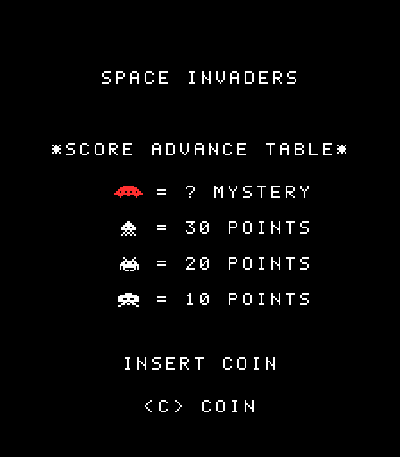

# insert-coin

Giochi arcade coin-op degli anni '80 ricostruiti da zero in **TypeScript** su **HTML5 Canvas**, con l'aiuto di Claude (AI) come compagno di sviluppo.

Il progetto ha due obiettivi:

1. **Giocare**: ogni gioco è una pagina web autonoma (un HTML, un CSS, un modulo JavaScript ES moderno).
2. **Imparare**: ogni passo è documentato con guide passo-passo, dalla creazione del monorepo alla collisione pixel-perfect, insieme a un diario di come è stata usata l'AI.

## Giochi



| Gioco                                   | Anno originale | Stato          |
| --------------------------------------- | -------------- | -------------- |
| [Space Invaders](games/space-invaders/) | 1978, Taito    | In costruzione |

## Avvio rapido

Servono **Node.js 22.13+ o 24 LTS** (consigliato; con nvm basta `nvm use`, la versione è in `.nvmrc`) e pnpm 10+ (`corepack enable` lo attiva). Con una versione di Node più vecchia `pnpm install` si ferma con un errore esplicito.

```bash
pnpm install
pnpm dev      # avvia Space Invaders con hot reload su http://localhost:5173
pnpm build    # build di produzione di tutti i giochi (games/*/dist)
```

Altri comandi: `pnpm test` (Vitest), `pnpm typecheck`, `pnpm lint`, `pnpm format`, `pnpm clean` (cancella tutti i `node_modules`), `pnpm clean:all` (anche `pnpm-lock.yaml`, per ricalcolare da zero le versioni delle dipendenze). Dopo entrambi serve `pnpm install`.

Dopo ogni `git pull` conviene eseguire `pnpm install`: se è arrivato un nuovo pacchetto `@arcade/*`, crea i collegamenti che gli servono.

## Struttura

```
insert-coin/
├── docs/                 guide passo-passo trasversali
├── packages/             codice condiviso fra i giochi (@arcade/*)
│   ├── engine-core/      game loop a timestep fisso, scene/stati
│   ├── input/            tastiera
│   ├── render/           canvas, scaling nitido, sprite bitmap, font pixel
│   ├── audio/            effetti sonori con Web Audio API
│   ├── collision/        AABB e collisione pixel-perfect
│   └── math/             vettori, clamp, random con seed
└── games/
    └── space-invaders/   un gioco = un'app Vite che usa i pacchetti @arcade/*
```

Ogni pacchetto ha una sola responsabilità e non conosce i giochi: i giochi dipendono dai pacchetti, mai il contrario.

## Scelte tecniche

- **Canvas "puro" invece di un framework come Phaser.** Lo scopo è mostrare come funzionano game loop, input e collisioni, non nasconderli. I giochi anni '80 non hanno bisogno di fisica o WebGL, e il bundle resta di pochi KB.
- **pnpm workspaces** per il monorepo: i pacchetti condivisi sono collegati localmente, senza pubblicarli.
- **TypeScript strict** con target ES2022: nessuna compatibilità con browser legacy.
- **Vite** per sviluppo e build; **Vitest** per i test.
- Codice e commenti in inglese, documentazione in italiano.

## Regole di sviluppo

Il codice è scritto per essere letto da persone (_code for humans, not for AI_): stile funzionale senza classi, dati immutabili, arrow function, funzioni piccole e testabili, un commento TSDoc per ogni funzione. Le regole complete, e come ESLint le verifica, sono in [CLAUDE.md](CLAUDE.md), che è anche il file di istruzioni letto da Claude.

## Documentazione

| Guida                                                  | Argomento                                                             |
| ------------------------------------------------------ | --------------------------------------------------------------------- |
| [00 · Introduzione](docs/00-introduzione.md)           | Obiettivi e metodo di lavoro con l'AI                                 |
| [01 · Setup del monorepo](docs/01-setup-monorepo.md)   | Creare il monorepo da zero, passo per passo                           |
| [02 · Game loop](docs/02-game-loop.md)                 | Loop a timestep fisso, testabile senza timer reali                    |
| [03 · Input da tastiera](docs/03-input-tastiera.md)    | Stato della tastiera, azioni, un poll per passo                       |
| [04 · Rendering e sprite](docs/04-rendering-sprite.md) | Sprite come testo, font bitmap, test senza browser                    |
| [05 · Collisioni](docs/05-collisioni.md)               | Rettangoli, pixel per pixel, tunneling                                |
| [06 · Audio](docs/06-audio.md)                         | Suoni sintetizzati con Web Audio, autoplay, suoni dedotti dallo stato |
| 07 · Build e deploy                                    | _in arrivo_                                                           |
| [Diario AI](docs/ai-workflow.md)                       | Prompt, decisioni e correzioni durante lo sviluppo                    |

## Licenza e diritti

Il codice è distribuito con licenza [MIT](LICENSE).

I giochi sono remake a scopo didattico. Grafica e suoni sono ricreati da zero; nessun asset originale è incluso. I nomi dei giochi appartengono ai rispettivi proprietari.
