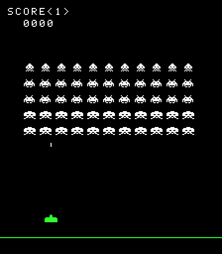

# 05 · Collisioni

Obiettivo: capire quando due oggetti si toccano. Alla fine Space Invaders ha la formazione di 55 alieni, il cannone spara, i colpi distruggono gli alieni con un'esplosione e il punteggio sale.



Codice: [`packages/collision/src`](../packages/collision/src).

## 1. Due livelli di precisione

Un gioco controlla le collisioni moltissime volte: ogni passo il colpo va confrontato con ogni alieno ancora in vita. Per questo si lavora su due livelli:

1. **Rettangoli (AABB)**: un test veloce e approssimato che scarta quasi tutte le coppie.
2. **Pixel per pixel**: preciso ma più costoso, eseguito solo sulle coppie che hanno superato il primo test.

## 2. Rettangoli: il test AABB

_AABB_ sta per _axis-aligned bounding box_: il rettangolo, allineato agli assi, che contiene lo sprite. Due rettangoli si sovrappongono **a meno che** uno sia completamente a sinistra, a destra, sopra o sotto l'altro:

```ts
export const rectsOverlap = (a: Rect, b: Rect): boolean =>
  a.x < b.x + b.width && b.x < a.x + a.width && a.y < b.y + b.height && b.y < a.y + a.height;
```

Le disuguaglianze sono strette (`<`): due rettangoli che si toccano solo lungo un bordo non collidono. È un dettaglio che conviene fissare con un test, perché un `<=` al posto di un `<` produce colpi "fantasma" di un pixel.

`intersection` restituisce l'area condivisa da due rettangoli: serve al livello successivo.

## 3. Pixel per pixel

Il rettangolo di un alieno contiene molti pixel vuoti: fra le gambe dell'octopus, attorno alla testa dello squid. Con i soli rettangoli un colpo che passa in quei buchi colpirebbe l'alieno, cosa che nell'originale non succede.

`bitmapsOverlap` fa prima il test dei rettangoli e, solo se passa, confronta i pixel **dell'area condivisa**:

```ts
export const bitmapsOverlap = (a: PlacedBitmap, b: PlacedBitmap): boolean => {
  const shared = intersection(boundsOf(a), boundsOf(b));
  return (
    shared !== undefined &&
    pixelsIn(shared).some(([x, y]) => isSolidAt(a, x, y) && isSolidAt(b, x, y))
  );
};
```

L'area condivisa fra un colpo di 1×4 pixel e un alieno è al massimo di 4 pixel: il costo del controllo preciso resta trascurabile.

Le posizioni vengono arrotondate a pixel interi con la stessa regola del disegno (`Math.round`). Così la collisione riguarda esattamente i pixel che il giocatore vede sullo schermo.

## 4. Un pacchetto che non dipende dal disegno

La collisione ha bisogno della forma degli sprite, ma non deve dipendere da `@arcade/render`. La soluzione è un'interfaccia minima:

```ts
export interface Bitmap {
  readonly width: number;
  readonly height: number;
  readonly pixels: readonly boolean[];
}
```

`Sprite` di `@arcade/render` ha esattamente questi campi. TypeScript usa la _tipizzazione strutturale_: conta la forma di un oggetto, non il nome del suo tipo. Quindi il gioco passa gli sprite a `bitmapsOverlap` direttamente, e i due pacchetti restano indipendenti.

## 5. Il problema del "tunneling"

Con un timestep fisso il colpo non si muove in modo continuo: salta di qualche pixel a ogni passo. Se il salto fosse più lungo dell'altezza di un alieno, il colpo potrebbe trovarsi sotto l'alieno in un passo e sopra nel successivo, senza mai toccarlo. Questo fenomeno si chiama _tunneling_.

In Space Invaders il colpo sale di 240 pixel al secondo, cioè 4 pixel per passo a 60 passi al secondo, e gli alieni sono alti 8 pixel: il tunneling non può capitare. Un test (`shot.test.ts`) lo verifica, così se in futuro qualcuno aumenta la velocità del colpo se ne accorge subito. Con oggetti più veloci servirebbero tecniche diverse, come controllare l'intero segmento percorso nel passo.

## 6. Uso in Space Invaders

Ogni file ha una sola responsabilità ed è testato da solo:

| File                                                         | Contenuto                                                                                         |
| ------------------------------------------------------------ | ------------------------------------------------------------------------------------------------- |
| [`aliens.ts`](../games/space-invaders/src/aliens.ts)         | La formazione: 5 righe da 11 alieni, squid in alto e octopus in basso, e i punti di ogni tipo     |
| [`shot.ts`](../games/space-invaders/src/shot.ts)             | Il colpo del cannone: parte dalla punta del cannone e sparisce sotto il punteggio                 |
| [`hits.ts`](../games/space-invaders/src/hits.ts)             | `findHitAlien`: l'alieno colpito, con collisione pixel per pixel                                  |
| [`explosions.ts`](../games/space-invaders/src/explosions.ts) | Le esplosioni, che restano sullo schermo per un quarto di secondo                                 |
| [`playing.ts`](../games/space-invaders/src/playing.ts)       | Il passo di gioco: muove il cannone, muove o spara il colpo, poi controlla i colpi andati a segno |

`updatePlaying` si legge come la descrizione del passo di gioco:

```ts
export const updatePlaying = (state, controls, dt) => {
  const cannon = moveCannon(state.cannon, controls.direction, dt);
  const shot = advanceShot(state.shot, cannon, controls.fire, dt);
  const moved = { ...state, cannon, shot, explosions: updateExplosions(state.explosions, dt) };
  const hit = shot && findHitAlien(shot, state.aliens);
  return nextWaveIfCleared(hit ? destroyAlien(moved, hit) : moved);
};
```

Come nell'originale, può esserci un solo colpo alla volta: finché è in volo, premere di nuovo il fuoco non fa nulla. Quando l'ultimo alieno viene distrutto arriva una nuova formazione.

Gli alieni per ora restano fermi: la marcia della formazione, le bombe e i bunker sono meccaniche specifiche del gioco e saranno descritte nelle guide in `games/space-invaders/docs/`.

## Verifica

```bash
pnpm test   # test di rettangoli, collisione pixel per pixel e logica di gioco
pnpm dev    # C per la moneta, frecce per muoversi, spazio per sparare
```

Prossima guida: [06 · Audio](06-audio.md).
